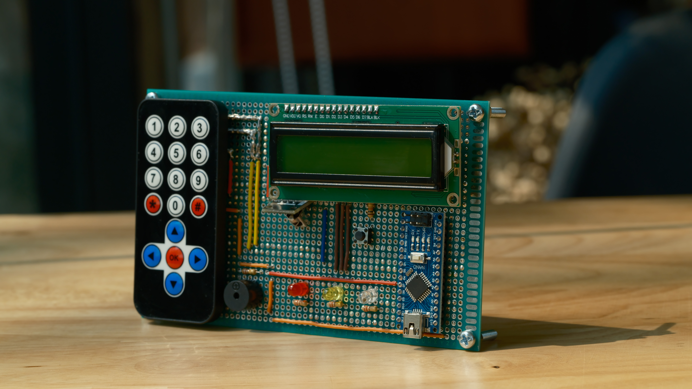

# Collision Prevention System

An Arduino-based real-time collision prevention and environmental monitoring system designed for autonomous vehicles & robots.

🎥 [Demo video](https://youtu.be/S9PfXs7jMV0) 🎥

## Features

- **Collision Prevention -** An ultrasonic sensor constantly records and updates data to check if any object gets close to the device. Once an object gets within 3 units (cm/in) of distance to the device, the device triggers a lock on all operations.
- **Warning Buzzer -** A buzzer will beep in accordance to the distance of any object that is detected by the ultrasonic sensor.
- **Warning LED Light -** A yellow LED will blink in accordance with the distance of any object that is detected by the ultrasonic sensor.
- **Locked LED Light -** A red LED will blink when the device is locked due to a close object.

- **Light Level Monitoring -** A photoresistor keeps track of the light level near the device.
- **Light Level LED Light -** A white LED will increase in brightness as the photoresistor detects lower light levels.

- **Data Display -** Data regarding the object distance and light level is shown on a 16x2 LCD screen. The unit of distance can be changed between centimeters and inches. The choice between cm/in is remembered and kept in the Arduino's EEPROM.
- **Remote Control -** Functions of the device can be done on an IR remote controller. These functions include: 
    - Unlocking the app
    - Switching between screens showing distance data and light level data
    - Switching distance units between cm/in

## Hardware Components

- **Arduino Nano -** System microcontroller
- **Ultrasonic Sensor -** Sensor to detect object distance from device
- **Photoresistor -** Sensor to detect light levels
- **Buzzer -** Makes a beeping noise in accordance to the object distance
- **LEDs -** LED lights to indicate warning, locking, and light levels
- **Push Button -** Button for manual unlocking of device
- **16x2 LCD Display -** Displays the sensor data along with options for resetting the device
- **IR Remote & Receiver -** For long range device control

<!--  -->

<!--  -->